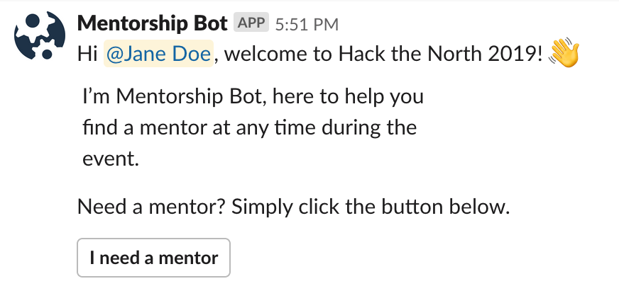
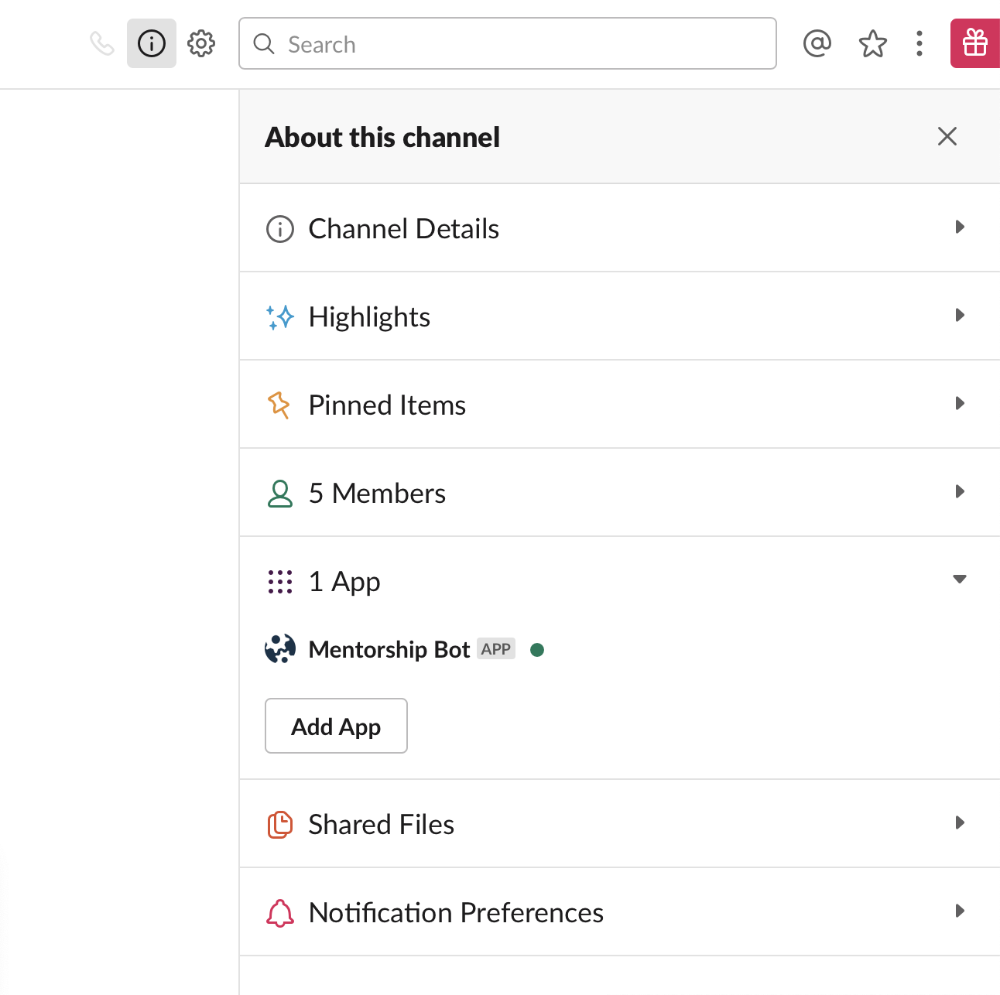

# Mentorship Slackbot

## General overview

### Workflow
Slackbot appears for all hackers, click button to ask for help. Bot asks for question.

1. Mentees interact with the BOT through DM.

Welcome Message | Request Popup     
:-:|:--:
 | 

2. The bot posts the request into the private channel of mentors. It will tag mentors with the relevant skill.

4. Mentor can claim the request, at which point a DM is created between the mentor, the requester, and the bot

5. The Mentor will receive controls via DM to close the request if it’s done, or surrender it back into the queue if they cannot do it

6. Bot pings a stats channel (e.g. #general) every 3 hours with updates and how to get in touch for help

7. Old, unclaimed requests are automatically bumped every 10 min if nobody has responded to it

### Mentors
1. Mentors can set their skills with the bot through the `!skills` command in DM

2. The bot automatically rescans the slack users list every 15 minutes. To have someone be a mentor, simply add them to the private mentors channel. 
3. All mentors have access to an additional `!stats` command to manually trigger a stats post.

### Errors
The bot will automatically report any runtime errors to the private mentors channel (tagging the mentor lead in the process!). 

## Tech Setup

### Data Store
This app is written in TypeScript and uses a local `lowdb` json database to store sessions. This json database file is automatically generated at runtime as [src/storage/db.json](src/storage/db.json). 

### Slack API
This bot requires a custom slack app to work. In particular, it requires the following Slack API components:
- Interactive Components
    - Request url: 
        - https://your-bot-url.com/slack/actions
- Event Subscriptions
    - Request url:
        - https://your-bot-url.com/slack/events
    - Bot events:
        - app_mention
        - im_created
        - message.groups
        - message.im
    - Workspace events:
        - team_join
- Bots
    - Set up the display name and default username as you wish
- Permissions
    - Redirect url:
        - https://your-bot-url.com/auth
    - Required scopes:
        - chat:write:bot
        - groups:write
        - bot (Add Bot User)
        - users:read

### Configuration
Configuration parameters are stored in [src/config/index.ts](src/config/index.ts). A sample configuration file is provided in this repo.

#### Access Token
If you're installing the bot onto your Slack through "distribution", you can get the relevant bot access token by simply installing it through the "manage distribution" page of your Slack app.
    1. Click the "Add to Slack" button 
    2. Click "Allow"
    3. Find your bot access token! (starts with xoxb) 

##### Bot/App Permissions
Remember to add your app to the channels your bot will post in, in particular the private mentors channel and the stats channel. 

#### Finding IDs
You can find User IDs, Channel IDs, and Group IDs in the URL on Slack. 

### Deployment
We use Kubernetes and [Skaffold](skaffold.dev). You will find the Kubernetes configuration file that we use in [kubernetes/deployment.yaml](kubernetes/deployment.yaml). Please feel free to use it as a template for your deployments.

## Technologies/Acknowledgements

- [lowdb](https://github.com/typicode/lowdb) for local document storage
- [TypeScript](http://www.typescriptlang.org/)
- [Node Slack SDK](https://slack.dev/node-slack-sdk/)